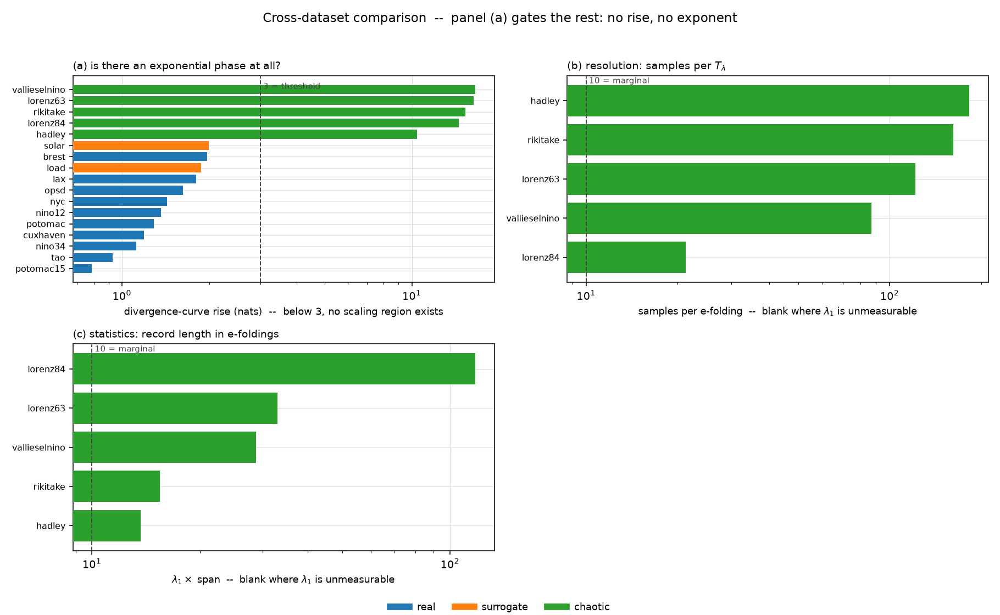
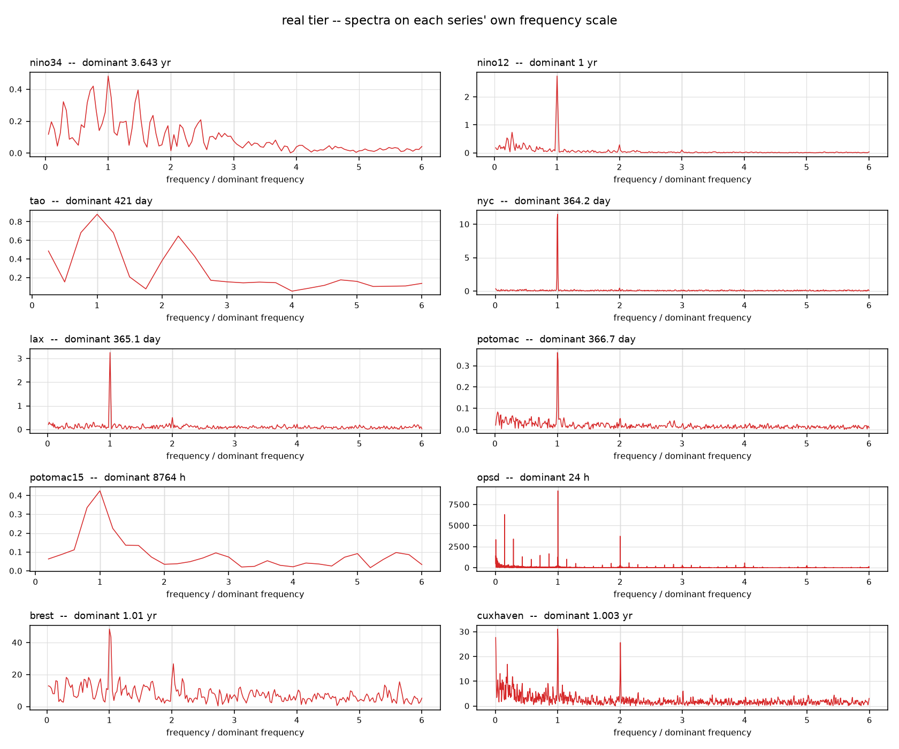

# Cross-dataset comparison

Generated by `compare.py`. Per-dataset figures and the method itself are documented in [analysis.md](analysis.md); the datasets themselves in [../Data/README.md](../Data/README.md).

> **12 of 17 datasets have no measurable λ₁.** Their divergence curve never rises far enough to contain an exponential phase, so there is no scaling region to fit and the row reports `--` rather than a fitted artefact. Every single-trajectory record here is in that category. See [analysis.md](analysis.md) for the evidence.

## All datasets

| dataset | tier | N | dt | span | rise | λ₁ | T_λ | T_λ (days) | samples/T_λ | e-foldings | dominant period | method |
|---|---|---|---|---|---|---|---|---|---|---|---|---|
| `hadley` | chaotic | 2,500 | 0.01455 natural | 36.37 natural | 10.4 | +0.3759 /natural | 2.66 natural | -- | 183 | 14 | 4.04 natural | ensemble |
| `lorenz63` | chaotic | 4,000 | 0.01 natural | 40 natural | 16.3 | +0.8231 /natural | 1.21 natural | -- | 121 | 33 | 4.44 natural | ensemble |
| `lorenz84` | chaotic | 2,500 | 0.06261 natural | 156.5 natural | 14.5 | +0.7499 /natural | 1.33 natural | -- | 21 | 117 | 6.26 natural | ensemble |
| `rikitake` | chaotic | 2,500 | 0.059 natural | 147.5 natural | 15.3 | +0.1049 /natural | 9.54 natural | -- | 162 | 15 | 7.02 natural | ensemble |
| `vallieselnino` | chaotic | 2,500 | 0.0221 natural | 55.24 natural | 16.5 | +0.5200 /natural | 1.92 natural | -- | 87 | 29 | 9.21 natural | ensemble |
| `brest` | real | 509 | 0.08333 yr | 42.42 yr | 2.0 | **--** | -- yr | -- | -- | 0 | 1.01 yr | rosenstein |
| `cuxhaven` | real | 2,058 | 0.08333 yr | 171.5 yr | 1.2 | **--** | -- yr | -- | -- | 0 | 1 yr | rosenstein |
| `lax` | real | 29,935 | 1 day | 2.994e+04 day | 1.8 | **--** | -- day | -- | -- | 0 | 365 day | rosenstein |
| `nino12` | real | 732 | 0.08333 yr | 61 yr | 1.4 | **--** | -- yr | -- | -- | 0 | 1 yr | rosenstein |
| `nino34` | real | 918 | 0.08333 yr | 76.5 yr | 1.1 | **--** | -- yr | -- | -- | 0 | 3.64 yr | rosenstein |
| `nyc` | real | 57,540 | 1 day | 5.754e+04 day | 1.4 | **--** | -- day | -- | -- | 0 | 364 day | rosenstein |
| `opsd` | real | 50,401 | 1 h | 5.04e+04 h | 1.6 | **--** | -- h | -- | -- | 0 | 24 h | rosenstein |
| `potomac` | real | 35,203 | 1 day | 3.52e+04 day | 1.3 | **--** | -- day | -- | -- | 0 | 367 day | rosenstein |
| `potomac15` | real | 175,284 | 0.25 h | 4.382e+04 h | 0.8 | **--** | -- h | -- | -- | 0 | 8.76e+03 h | rosenstein |
| `tao` | real | 1,684 | 1 day | 1684 day | 0.9 | **--** | -- day | -- | -- | 0 | 421 day | rosenstein |
| `load` | surrogate | 26,280 | 1 h | 2.628e+04 h | 1.9 | **--** | -- h | -- | -- | 0 | 24 h | rosenstein |
| `solar` | surrogate | 17,520 | 0.5 h | 8760 h | 2.0 | **--** | -- h | -- | -- | 0 | 24 h | rosenstein |

## How to read this

- **rise** is the total climb of the divergence curve, in nats, and it decides whether the rest of the row exists. A chaotic system climbs from ln(ic_eps) to ln(attractor diameter): 10–17 nats across the chaotic tier. White noise climbs ~1. Below 3 there is no exponential phase and λ₁ is reported as `--`.
- **λ₁, T_λ** are in each dataset's own time unit; **T_λ (days)** puts the physical records on one clock. The chaotic tier has no physical clock, so that column is blank for it.
- **samples/T_λ** is a resolution check. Below ~10 the divergence curve has too few points inside its scaling region to fit.
- **e-foldings** is a statistics check: how many times the record could have lost its initial condition. Below ~10 there is little to average over.
- **method**: only `ensemble` rows can be measurements, and those carry ~31% mean absolute error. `rosenstein` misses by ~93% even on ground truth, so no `rosenstein` row is quoted as a value.

## The datasets

Source, physical meaning and known traps for each series, in the order the table above uses. Documentation lives in `provenance.py`; the measured numbers come from `analysis.py`.

### real tier

#### `brest` — Brest tide gauge, monthly mean sea level

- **Source**: [PSMSL](https://psmsl.org/) station 1, Revised Local Reference series
- **Observable**: monthly mean sea level in mm on the RLR datum
- **Measured**: N = 509, Δt = 0.08333 yr, span = 42.42 yr, λ₁ = not measurable (curve rises 2.0 nats, needs 3)

One of the longest instrumental records on Earth, beginning **1807**. Sea level integrates thermal expansion, ice-mass exchange, atmospheric pressure and local land motion. Maps to SDG 13/14.

**Watch out**

- 11.9% missing with a 120-month gap, so it is loaded with `longest_run=True`: 509 of 2,622 months, about 42 years.
- That crop is also why it does not fail the way `cuxhaven` does -- it drops most of the secular trend along with most of the record.
- Contains a strong secular trend (sea-level rise). Detrend before any dynamical claim.

#### `cuxhaven` — Cuxhaven tide gauge, monthly mean sea level

- **Source**: PSMSL station 10, Revised Local Reference series
- **Observable**: monthly mean sea level in mm on the RLR datum
- **Measured**: N = 2,058, Δt = 0.08333 yr, span = 171.5 yr, λ₁ = not measurable (curve rises 1.2 nats, needs 3)

A German Bight record from 1854, far more complete than Brest (0.44% missing) and therefore analysed at full length.

**Watch out**

- **Returns lambda_1 = -2.2 /yr, which is an estimator failure, not a finding.** A strong secular trend plus a dominant annual line makes embedded neighbours converge rather than diverge, so the fit reports a negative slope and T_lambda = infinity.
- Detrend and deseasonalise before believing anything about sea-level dynamics from this series.
- North Sea storm surge makes the local signal much noisier than open-ocean sea level.

#### `lax` — Los Angeles International Airport, daily maximum temperature

- **Source**: NOAA NCEI GHCN-Daily, station USW00023174
- **Observable**: daily maximum air temperature in degC
- **Measured**: N = 29,935, Δt = 1 day, span = 2.994e+04 day, λ₁ = not measurable (curve rises 1.8 nats, needs 3)

A contrasting climate regime to `nyc`: coastal Mediterranean, with a far weaker seasonal cycle and much lower day-to-day variance (sd 4.1 degC against 10.4). Useful as a control on whether an estimate is tracking weather or tracking the annual cycle.

**Watch out**

- 82 years rather than 157, but comparably clean.

#### `nino12` — Nino 1+2 sea-surface temperature (absolute)

- **Source**: NOAA/NCEP, bundled with statsmodels; pinned in `Data/real/enso_nino12_1950_2010.csv`
- **Observable**: monthly mean SST in degC (not an anomaly)
- **Measured**: N = 732, Δt = 0.08333 yr, span = 61 yr, λ₁ = not measurable (curve rises 1.4 nats, needs 3)

The record the existing QRC walkthrough was built on. The Nino 1+2 region (0-10S, 90W-80W) hugs the South American coast, where SST variance phase-locks to boreal spring rather than the DJF peak of Nino 3.4.

**Watch out**

- **Raw SST, so the annual cycle dominates the spectrum** at four times the amplitude of any other line. This is what inflates its lambda_1 to 3.6x the Nino 3.4 value -- the phase-matching artefact, running live.
- Ends in 2010, and is not directly comparable with `nino34` without deseasonalising first.
- Kept for continuity with published results. Prefer `nino34` for new work.

#### `nino34` — Nino 3.4 sea-surface-temperature anomaly

- **Source**: [NOAA PSL](https://psl.noaa.gov/data/timeseries/monthly/NINO34/), ERSST v6
- **Observable**: monthly SST anomaly in degC, averaged over the Nino 3.4 box (5N-5S, 170W-120W)
- **Measured**: N = 918, Δt = 0.08333 yr, span = 76.5 yr, λ₁ = not measurable (curve rises 1.1 nats, needs 3)

The standard index of El Nino / La Nina state, and the target the whole QRC pipeline was built around. Positive excursions are El Nino, negative La Nina; the +/-0.5 degC threshold is the operational event definition.

**Watch out**

- Already an anomaly -- a monthly climatology was subtracted upstream, so the annual cycle is gone before you see it. Do not deseasonalise twice.
- A gridded reanalysis blending ship, buoy and satellite observations, not a direct measurement.
- 918 monthly points is a short record for a Lyapunov estimate: 13 e-foldings total.

#### `nyc` — New York Central Park, daily maximum temperature

- **Source**: [NOAA NCEI GHCN-Daily](https://www.ncei.noaa.gov/products/land-based-station/global-historical-climatology-network-daily), station USW00094728
- **Observable**: daily maximum air temperature in degC (TMAX, converted from the archive's tenths)
- **Measured**: N = 57,540, Δt = 1 day, span = 5.754e+04 day, λ₁ = not measurable (curve rises 1.4 nats, needs 3)

Mid-latitude weather at a single station, and the longest record in this collection at any cadence: **157.5 years, 57,540 daily observations, 7 missing values**. Its dynamics are synoptic weather -- the passage of frontal systems -- rather than climate.

**Watch out**

- Its T_lambda of 16 days lands on the textbook ~2-week atmospheric predictability limit without any tuning, which is the strongest evidence in this directory that the pipeline is sound when the data is good.
- Urban heat-island growth over 157 years is a real non-stationarity, even though GHCN applies quality control.
- TMAX is a daily *extremum*, not a daily mean, so it is a nonlinear functional of the underlying continuous process.

#### `opsd` — German electricity load, hourly

- **Source**: [Open Power System Data](https://data.open-power-system-data.org/time_series/), originally ENTSO-E Transparency
- **Observable**: actual national electricity demand in MW, hourly
- **Measured**: N = 50,401, Δt = 1 h, span = 5.04e+04 h, λ₁ = not measurable (curve rises 1.6 nats, needs 3)

Real grid demand -- the physical counterpart to the `load` surrogate. Human activity cycles (diurnal, weekly, annual) plus a weather-driven heating/cooling response. Germany is the largest and most complete series in the 25-country file.

**Watch out**

- **The surrogate is over-chaotic by 2.7x**: real demand gives T_lambda = 56.5 h against the surrogate's 21.1 h, with both showing the same 24 h dominant line. Anything tuned on `load` should be re-checked here.
- Only 2014-12 to 2020-09; the upstream release stops there.
- T_lambda/period = 2.35, close enough to the diurnal cycle that some phase-matching contribution is plausible.

#### `potomac` — Potomac River discharge, daily

- **Source**: [USGS NWIS](https://waterservices.usgs.gov/) gauge 01646500, 'Potomac River near Washington DC, Little Falls Pump Station' (38.9498N, 77.1276W)
- **Observable**: daily mean discharge in cubic feet per second, analysed as log10(Q)
- **Measured**: N = 35,203, Δt = 1 day, span = 3.52e+04 day, λ₁ = not measurable (curve rises 1.3 nats, needs 3)

River flow integrating rainfall, snowmelt and groundwater over an 11,500 square-mile basin -- a physically filtered, heavily damped response to weather forcing. Maps to SDG 6 (clean water and sanitation).

**Watch out**

- **Only 5 samples per T_lambda -- below the ~10 needed for a scaling region to exist.** Its own 15-minute record disagrees by a factor of 14. Prefer `potomac15`.
- Discharge spans 121 to 426,000 cfs, so it is analysed as log10(Q); a few flood peaks would otherwise set the scale for the spectrum and the neighbour search alike.
- Flow is regulated upstream and abstracted for DC's water supply, so this is not a natural catchment response.

#### `potomac15` — Potomac River discharge, 15-minute

- **Source**: USGS NWIS instantaneous-values service, same gauge 01646500
- **Observable**: instantaneous discharge in cfs at nominal 15-minute spacing, analysed as log10(Q)
- **Measured**: N = 175,284, Δt = 0.25 h, span = 4.382e+04 h, λ₁ = not measurable (curve rises 0.8 nats, needs 3)

The same river as `potomac` at 60x the cadence, and the highest-frequency real record in this collection (175,284 samples after resampling). Because it is the same physical system measured two ways, the pair is a direct test of how much sampling rate alone moves the exponent.

**Watch out**

- **The raw feed is not on a clean grid** -- 44% of steps differ from 15 minutes, some running to 19 hours. The loader resamples onto a uniform grid before anything else touches it.
- Five years only: the instantaneous service will not serve long spans.
- Gives T_lambda = 0.4 days against 5.5 days for the daily record of the same river. Sampling rate is setting the exponent.

#### `tao` — TAO/TRITON moored buoy SST, 0N 140W

- **Source**: [NOAA PMEL](https://www.pmel.noaa.gov/gtmba/pmel-theme/pacific-ocean-tao) via ERDDAP (`pmelTaoDySst`, variable `T_25`)
- **Observable**: daily-mean sea surface temperature in degC from a moored buoy on the equator at 140W
- **Measured**: N = 1,684, Δt = 1 day, span = 1684 day, λ₁ = not measurable (curve rises 0.9 nats, needs 3)

A direct in-situ measurement of the same ocean the Nino indices average over, at *daily* rather than monthly cadence. 0N 140W sits in the equatorial cold tongue, the region where the ENSO SST signal is strongest. The parent file carries five moorings spanning 165E to 110W; per-site standard deviation rises from 0.79 degC in the warm pool to 2.21 degC in the cold tongue, which is the ENSO signal strengthening eastward.

**Watch out**

- **25-39% missing per site, with gaps of 1,135-4,153 consecutive days** from the array's funding-driven degradation around 2012-2014.
- Loaded with `longest_run=True`, which crops a 46-year record to its longest gapless stretch: 1,684 of 16,919 days, about 4.6 years.
- The five moorings are *not* independent realizations -- they are dynamically coupled along the equator, so their spread is a lower bound on true ensemble spread and cannot drive the ensemble estimator.

### surrogate tier

#### `load` — System load surrogate, hourly

- **Source**: generated by `QRC_code_stack/stage1_numpy_core/datasets.py` at a fixed seed
- **Observable**: system electricity load in MW, three years
- **Measured**: N = 26,280, Δt = 1 h, span = 2.628e+04 h, λ₁ = not measurable (curve rises 1.9 nats, needs 3)

Weekly and diurnal profiles times an annual seasonality, plus a CDD/HDD temperature response, an AR(1) residual and holiday suppression.

**Watch out**

- **Synthetic, and demonstrably over-chaotic**: T_lambda = 21.1 h against 56.5 h for real German demand (`opsd`). Its AR(1) residual is noisier than reality.
- Use `opsd` for any claim meant to be about electricity demand.

#### `solar` — Solar GHI surrogate, 30-minute

- **Source**: generated by `QRC_code_stack/stage1_numpy_core/datasets.py` at a fixed seed
- **Observable**: global horizontal irradiance in W/m^2, one year, latitude 1.35N
- **Measured**: N = 17,520, Δt = 0.5 h, span = 8760 h, λ₁ = not measurable (curve rises 2.0 nats, needs 3)

Haurwitz clear-sky geometry multiplied by a two-state Markov cloud process, with sensor-outage gaps injected. Built so that the deterministic part (solar position) and the stochastic part (cloud) are separable by construction.

**Watch out**

- **Synthetic.** lambda_1 describes the generator, not any sky.
- The injected outages are interpolated on load, which biases the exponent optimistic.
- Its real counterpart, BSRN 1-minute irradiance, needs an account and so is not vendored.

### chaotic tier

#### `hadley` — Hadley cell convection

- **Source**: [dysts](https://github.com/williamgilpin/dysts) -- 135 chaotic systems, each annotated with a numerically estimated largest Lyapunov exponent (Gilpin, NeurIPS 2021)
- **Observable**: dimensionless convective amplitude
- **Measured**: N = 2,500, Δt = 0.01455 natural, span = 36.37 natural, λ₁ = +0.3759 /natural, T_λ = 2.66 natural (ensemble)

Thermal convection in a rotating annulus, the idealised Hadley circulation that transports heat from the tropics poleward.

**Watch out**

- Ensemble estimate is +57.5% against its reference value.

#### `lorenz63` — Lorenz-63, x-component

- **Source**: integrated locally by `Data/fetch_data.py` (RK4, dt=0.01, sigma=10, rho=28, beta=8/3)
- **Observable**: dimensionless convective overturning rate; arbitrary units
- **Measured**: N = 4,000, Δt = 0.01 natural, span = 40 natural, λ₁ = +0.8231 /natural, T_λ = 1.21 natural (ensemble)

The canonical chaotic system: a 3-mode truncation of Rayleigh-Benard convection. Its reference lambda_1 = 0.9056 is a standard literature value rather than a re-estimate, which makes it the cleanest calibration target here.

**Watch out**

- Non-dimensional time. Its 'natural' unit has no physical meaning, so T_lambda cannot be compared in days against the observed records.

#### `lorenz84` — Lorenz-84 general circulation

- **Source**: [dysts](https://github.com/williamgilpin/dysts) -- 135 chaotic systems, each annotated with a numerically estimated largest Lyapunov exponent (Gilpin, NeurIPS 2021)
- **Observable**: dimensionless westerly wind amplitude and eddy components
- **Measured**: N = 2,500, Δt = 0.06261 natural, span = 156.5 natural, λ₁ = +0.7499 /natural, T_λ = 1.33 natural (ensemble)

Lorenz's low-order model of the mid-latitude atmospheric circulation: a westerly jet coupled to two eddy modes, forced by the equator-to-pole temperature contrast. The conceptual ancestor of the weather-predictability question that the GHCN station records answer empirically.

**Watch out**

- Our ensemble estimate is +62.5% against its reference value -- the worst error in the chaotic tier, and a reminder that the estimator is not uniformly reliable.

#### `rikitake` — Rikitake two-disc dynamo

- **Source**: [dysts](https://github.com/williamgilpin/dysts) -- 135 chaotic systems, each annotated with a numerically estimated largest Lyapunov exponent (Gilpin, NeurIPS 2021)
- **Observable**: dimensionless current in two coupled disc dynamos
- **Measured**: N = 2,500, Δt = 0.059 natural, span = 147.5 natural, λ₁ = +0.1049 /natural, T_λ = 9.54 natural (ensemble)

A two-disc dynamo whose current spontaneously reverses polarity -- the classic minimal model for geomagnetic field reversals. Included as a slow-exponent test case: at lambda_1 = 0.13 it stresses the estimator differently from the fast systems.

**Watch out**

- Ensemble estimate is -20.4%.
- The only chaotic system whose T_lambda/period ratio exceeds 1 (1.36), so its exponent and its dominant oscillation are not well separated.

#### `vallieselnino` — Vallis ENSO oscillator

- **Source**: [dysts](https://github.com/williamgilpin/dysts) -- 135 chaotic systems, each annotated with a numerically estimated largest Lyapunov exponent (Gilpin, NeurIPS 2021)
- **Observable**: dimensionless zonal current / thermocline anomaly
- **Measured**: N = 2,500, Δt = 0.0221 natural, span = 55.24 natural, λ₁ = +0.5200 /natural, T_λ = 1.92 natural (ensemble)

A low-order coupled ocean-atmosphere model of El Nino: wind stress drives an equatorial current, which advects the thermocline, which feeds back on the wind. The most relevant chaotic system in this collection -- it is a toy model of the same physics the Nino indices observe, so it is the natural sanity check for any method later applied to ENSO.

**Watch out**

- A caricature of ENSO, not a simulation of it. Agreement with the real indices would be a coincidence of timescales, not validation.
